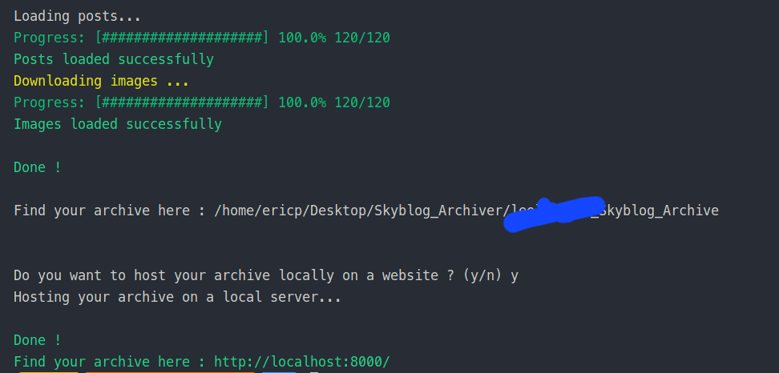

# 📰 Skyblog Archive Client 📰

## One day project

Welcome to the Skyblog Archive Client! This client is designed to help you securely store and archive all the posts from your Skyblog before the platform shuts down. It allows you to preserve your cherished memories and valuable content in a local and safe manner.

---

## Table of Contents

- [Project Context](#project-context)
- [Project Description](#project-description)
- [Features](#features)
- [Installation](#installation)
- [Installation - Linux](#linux)
- [Installation - Windows](#windows)

---

### Project Context

    "My gf used to have a Skyblog around the 2000s. She recently found out that the platform is shutting down and that she will lose all her posts and images. I decided to create this client to help her and anyone else who wants to preserve their Skyblog content in a the format of a one day project.""

## Project Description

With the imminent closure of the Skyblog platform, it's crucial to ensure that your posts and associated media are not lost forever. The Skyblog Archive Client provides a simple yet powerful solution to download and store your entire Skyblog archive, including posts, images, and comments. By utilizing this client, you can safeguard your content and maintain full control over your valuable memories.

## Features

- Download and archive your complete Skyblog content.
  
- Preserve posts, and save locally your images.
- Seamlessly store your Skyblog archive locally and securely.
- CLI-based interface for ease of use.
  
- Convert your Skyblog archive to a static website.
  

## Installation

1. Clone this repository to your local machine.

---

### Linux -

2. Add the permissions to execute the script:

```bash
chmod +x archiver.sh
```

3. Run the script:

```bash
./archiver.sh
```

> If you run into any issues, try running the full_archiver.sh script instead.

---

### Windows -

2. Open the command prompt:

- Press the Windows key, type cmd, and press Enter.

3. Navigate to the directory where you cloned the repository and run the script:

```bash
archiver.cmd
```

---

> The script will install automatically all the dependencies required to run the client.

---

3. Follow the instructions in the command prompt.

4. At the end the script will ask you if you want to run a local server to view your Skyblog archive. If you choose to do so, the script will automatically launch a local server and open your Skyblog archive in your default browser.

> Not tested on Windows and MacOS.
